# Entity Relationship Diagram (ERD)

This ERD supports a production-style Cyber Security Incident Management Platform built with Laravel 12, MySQL, Bootstrap 5, jQuery, DataTables, and SweetAlert2. It reflects the existing database design, migration plan, and schema blueprint documents for the project.

The diagram keeps planned table names aligned with the current blueprint. IOC tracking is represented by `incident_iocs`, and evidence attachment tracking is represented by `incident_evidences`.

## Core ERD

```mermaid
erDiagram
    users {
        BIGINT id PK
        STRING name
        STRING email UK
        TIMESTAMP email_verified_at
        STRING password
        BOOLEAN is_active
        TIMESTAMP created_at
        TIMESTAMP updated_at
    }

    password_reset_tokens {
        STRING email PK
        STRING token
        TIMESTAMP created_at
    }

    sessions {
        STRING id PK
        BIGINT user_id FK
        STRING ip_address
        TEXT user_agent
        LONGTEXT payload
        INTEGER last_activity
    }

    cache {
        STRING key PK
        MEDIUMTEXT value
        INTEGER expiration
    }

    cache_locks {
        STRING key PK
        STRING owner
        INTEGER expiration
    }

    jobs {
        BIGINT id PK
        STRING queue
        LONGTEXT payload
        TINYINT attempts
        INTEGER reserved_at
        INTEGER available_at
        INTEGER created_at
    }

    job_batches {
        STRING id PK
        STRING name
        INTEGER total_jobs
        INTEGER pending_jobs
        INTEGER failed_jobs
        LONGTEXT failed_job_ids
        MEDIUMTEXT options
        INTEGER created_at
        INTEGER finished_at
    }

    failed_jobs {
        BIGINT id PK
        STRING uuid UK
        TEXT connection
        TEXT queue
        LONGTEXT payload
        LONGTEXT exception
        TIMESTAMP failed_at
    }

    roles {
        BIGINT id PK
        STRING name
        STRING slug UK
        TEXT description
        BOOLEAN is_active
        TIMESTAMP created_at
        TIMESTAMP updated_at
    }

    permissions {
        BIGINT id PK
        STRING name
        STRING slug UK
        STRING group_name
        TEXT description
        BOOLEAN is_active
        TIMESTAMP created_at
        TIMESTAMP updated_at
    }

    role_user {
        BIGINT id PK
        BIGINT role_id FK
        BIGINT user_id FK
        TIMESTAMP created_at
        TIMESTAMP updated_at
    }

    permission_role {
        BIGINT id PK
        BIGINT permission_id FK
        BIGINT role_id FK
        TIMESTAMP created_at
        TIMESTAMP updated_at
    }

    incident_categories {
        BIGINT id PK
        STRING name
        STRING slug UK
        TEXT description
        STRING color
        INTEGER sort_order
        BOOLEAN is_active
        TIMESTAMP created_at
        TIMESTAMP updated_at
    }

    severity_levels {
        BIGINT id PK
        STRING name
        STRING slug UK
        TEXT description
        STRING color
        INTEGER sort_order
        BOOLEAN is_active
        TIMESTAMP created_at
        TIMESTAMP updated_at
    }

    priority_levels {
        BIGINT id PK
        STRING name
        STRING slug UK
        TEXT description
        STRING color
        INTEGER sort_order
        BOOLEAN is_active
        TIMESTAMP created_at
        TIMESTAMP updated_at
    }

    incident_statuses {
        BIGINT id PK
        STRING name
        STRING slug UK
        TEXT description
        STRING color
        INTEGER sort_order
        BOOLEAN is_active
        TIMESTAMP created_at
        TIMESTAMP updated_at
    }

    incidents {
        BIGINT id PK
        STRING incident_number UK
        STRING title
        LONGTEXT description
        BIGINT category_id FK
        BIGINT severity_level_id FK
        BIGINT priority_level_id FK
        BIGINT status_id FK
        BIGINT reported_by_id FK
        BIGINT current_assigned_to_id FK
        STRING detection_source
        STRING affected_asset
        DATETIME occurred_at
        DATETIME reported_at
        DATETIME resolved_at
        DATETIME closed_at
        TIMESTAMP created_at
        TIMESTAMP updated_at
    }

    incident_assignments {
        BIGINT id PK
        BIGINT incident_id FK
        BIGINT assigned_to_id FK
        BIGINT assigned_by_id FK
        TEXT note
        DATETIME assigned_at
        TIMESTAMP created_at
        TIMESTAMP updated_at
    }

    investigation_notes {
        BIGINT id PK
        BIGINT incident_id FK
        BIGINT user_id FK
        LONGTEXT note
        STRING visibility
        TIMESTAMP created_at
        TIMESTAMP updated_at
    }

    incident_iocs {
        BIGINT id PK
        BIGINT incident_id FK
        STRING type
        STRING value "2048"
        TEXT description
        STRING confidence
        DATETIME first_seen_at
        DATETIME last_seen_at
        BIGINT created_by_id FK
        TIMESTAMP created_at
        TIMESTAMP updated_at
    }

    incident_evidences {
        BIGINT id PK
        BIGINT incident_id FK
        BIGINT uploaded_by_id FK
        STRING title
        TEXT description
        STRING original_filename
        STRING stored_path
        STRING mime_type
        BIGINT file_size
        STRING checksum_sha256
        TIMESTAMP created_at
        TIMESTAMP updated_at
    }

    response_actions {
        BIGINT id PK
        BIGINT incident_id FK
        STRING action_type
        LONGTEXT description
        BIGINT performed_by_id FK
        DATETIME performed_at
        TEXT outcome
        TIMESTAMP created_at
        TIMESTAMP updated_at
    }

    audit_logs {
        BIGINT id PK
        BIGINT user_id FK
        STRING event
        STRING auditable_type
        BIGINT auditable_id
        JSON old_values
        JSON new_values
        STRING ip_address
        TEXT user_agent
        TIMESTAMP created_at
    }

    security_reports {
        BIGINT id PK
        BIGINT generated_by_id FK
        STRING title
        STRING report_type
        JSON filters
        STRING file_path
        DATETIME generated_at
        TIMESTAMP created_at
        TIMESTAMP updated_at
    }

    users |o--o{ sessions : may_have_sessions
    users ||--o{ role_user : receives_role_links
    roles ||--o{ role_user : assigned_to_users
    roles ||--o{ permission_role : receives_permission_links
    permissions ||--o{ permission_role : granted_to_roles

    users ||--o{ incidents : reports
    users |o--o{ incidents : currently_assigned
    incident_categories ||--o{ incidents : categorizes
    severity_levels ||--o{ incidents : defines_severity
    priority_levels ||--o{ incidents : defines_priority
    incident_statuses ||--o{ incidents : defines_status

    incidents ||--o{ incident_assignments : keeps_assignment_history
    users ||--o{ incident_assignments : assigned_as_analyst
    users ||--o{ incident_assignments : assigns_incident

    incidents ||--o{ investigation_notes : has_investigation_notes
    users ||--o{ investigation_notes : writes_notes

    incidents ||--o{ incident_iocs : has_indicators
    users ||--o{ incident_iocs : creates_iocs

    incidents ||--o{ incident_evidences : has_evidence
    users ||--o{ incident_evidences : uploads_evidence

    incidents ||--o{ response_actions : has_response_actions
    users ||--o{ response_actions : performs_actions

    users |o--o{ audit_logs : optionally_triggers
    users ||--o{ security_reports : generates_reports
```

## Relationship Notes

- `users` is the central identity table for reporters, analysts, managers, administrators, responders, and report generators.
- `users` reports incidents through `incidents.reported_by_id`.
- `users` can be the currently assigned analyst through nullable `incidents.current_assigned_to_id`, while `incident_assignments` preserves full assignment history.
- `roles` and `users` are connected through `role_user` to support many-to-many role assignment.
- `roles` and `permissions` are connected through `permission_role` to support granular authorization.
- Each incident belongs to one `incident_categories` record, one `severity_levels` record, one `priority_levels` record, and one `incident_statuses` record.
- `incidents` has many `incident_assignments`, `investigation_notes`, `incident_iocs`, `incident_evidences`, and `response_actions`.
- `investigation_notes` records analyst timeline entries for an incident.
- `incident_iocs` records indicators of compromise such as IP addresses, domains, URLs, file hashes, email addresses, malware filenames, process names, registry keys, and other observables.
- `incident_evidences` stores evidence attachment metadata while files remain in Laravel storage.
- `response_actions` records containment, eradication, recovery, and communication actions.
- `audit_logs` can optionally reference a user, allowing system actions to be logged while keeping polymorphic-style auditable fields free of strict foreign keys.
- `security_reports` stores generated report metadata, including JSON filters and optional exported file paths.
- Laravel default tables such as `password_reset_tokens`, `sessions`, `cache`, `cache_locks`, `jobs`, `job_batches`, and `failed_jobs` remain framework-managed support tables.

## Workflow View

- Incident reporting starts when a user creates an `incidents` record with a unique `incident_number`, title, description, category, severity, priority, status, and reporter reference.
- Severity and priority classification is handled through `severity_levels` and `priority_levels`, giving dashboards and reports consistent filtering values.
- Status workflow is controlled through `incident_statuses`, supporting stages such as reported, triaged, assigned, investigating, contained, resolved, and closed.
- Analyst assignment is supported by nullable `incidents.current_assigned_to_id` for quick filtering and by `incident_assignments` for full assignment history.
- Investigation notes are stored in `investigation_notes` so SOC analysts can maintain a clear incident timeline.
- IOC tracking is handled through `incident_iocs`, allowing analysts to record observable indicators connected to an incident. In the Laravel implementation, these records map to `Incident::iocs()`, `IncidentIoc::incident()`, `IncidentIoc::createdBy()`, and `User::createdIocs()`.
- Evidence tracking is handled through `incident_evidences`, which stores metadata, file paths, file sizes, MIME types, and checksums while files live in Laravel storage.
- Response actions are recorded in `response_actions` to show what containment, remediation, or communication steps were performed.
- Audit logging is handled through `audit_logs`, preserving user-driven and system-driven security events for accountability.
- Security reporting is handled through `security_reports`, allowing generated reports to reference report type, filters, generated file paths, and generating users.

## Portfolio Notes

- This ERD demonstrates production-minded database planning for a security-focused Laravel application.
- It shows clear separation between framework-managed Laravel tables and custom incident management domain tables.
- It documents many-to-many role and permission modeling, incident lifecycle tracking, analyst workflow history, evidence metadata, IOC management, audit logging, and reporting.
- It supports future migration work by making primary keys, foreign keys, business fields, nullable references, and relationships easy to review before implementation.
- It reinforces conservative data retention decisions that are appropriate for cyber security incident management systems.
